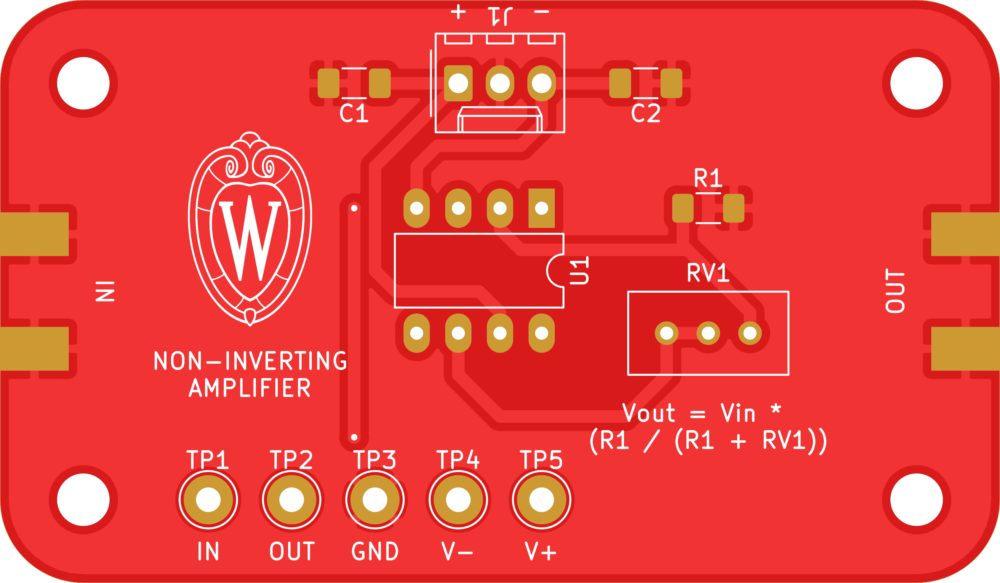
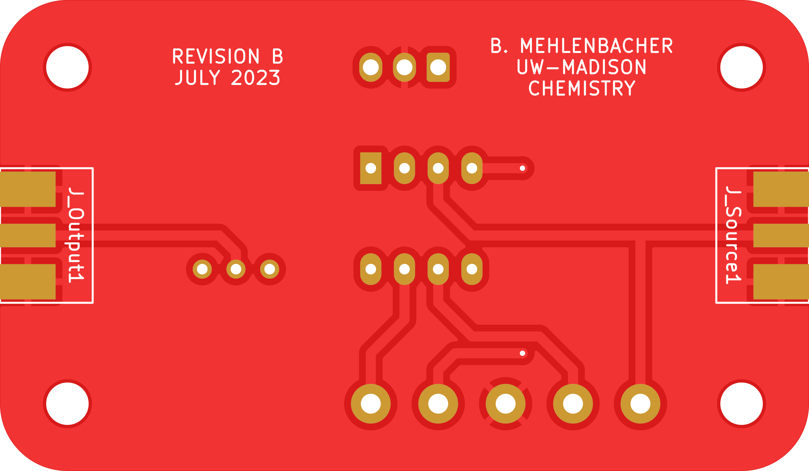

# non-inverting-amplifier

A very simple non-inverting amplifier.

## PCB

This PCB was designed using KiCAD version 7.
Refer to `DC_Amplifier.pdf` for schematic.
PCB images generated with [tracespace](https://github.com/tracespace/tracespace) follow.

Bill of Materials

| reference      | value          | manufacturer | part number          | vendors |
| :------------- | :------------- | :----------- | :------------------- | :------ |
| C1, C2         | 100 uF         | TDK          | C3216X5R1A107M160AC  | [DigiKey](https://www.digikey.com/en/products/detail/tdk-corporation/C3216X5R1A107M160AC/2444048) [Newark](https://www.newark.com/tdk/c3216x5r1a107m160ac/ceramic-capacitor-100uf-10v-x5r/dp/04X3294?st=c3216x5r1a107m160ac) |
| J1             | power entry    | Molex        | 22-23-2031           | [DigiKey](https://www.digikey.com/en/products/detail/molex/0022232031/26669?s=N4IgTCBcDa5gtGAzIgDEgjCAugXyA) [Newark](https://www.newark.com/molex/22-23-2031/connector-header-3pos-1row-2-54mm/dp/30C0862?ost=0022232031) |
| J2, J3         | source, output | Molex        | 0732512120           | [DigiKey](https://www.digikey.com/en/products/detail/molex/0732512120/1465158?s=N4IgTCBcDaIAQAYDsBmMBWAjGbCQF0BfIA) |
| R1             | 1k             | Yageo        | RC1206FR-071KL       | [DigiKey](https://www.digikey.com/en/products/detail/yageo/RC1206FR-071KL/728387?s=N4IgTCBcDaIAQCUDCBGMAGAbAMQQWnQHYUBpAGRAF0BfIA) [Newark](https://www.newark.com/yageo-phycomp/rc1206fr-071kl/thick-film-resistor-1kohm-250mw/dp/98K7619?st=rc1206fr-071kl) |
| RV1            | 100k trimpot   | Bourns       | 3296W-1-104LF        | [DigiKey](https://www.digikey.com/en/products/detail/bourns-inc/3296W-1-104LF/1088046?s=N4IgjCBcoLQBxVAYygMwIYBsDOBTANCAPZQDa4YCAugL42EBMZIAzAwJwBsA6jGHwAYALABkAYiFpA) [Newark](https://www.newark.com/bourns/3296w-1-104lf/trimmer-potentiometer-100kohm/dp/62J1426?st=3296w-1-104lf) |
| TP1, TP2       | yellow         | Keystone     | 5014                 | [DigiKey](https://www.digikey.com/en/products/detail/keystone-electronics/5014/255336) |
| TP3            | green          | Keystone     | 5126                 | [DigiKey](https://www.digikey.com/en/products/detail/keystone-electronics/5126/2170329) |
| TP4            | black          | Keystone     | 5011                 | [DigiKey](https://www.digikey.com/en/products/detail/keystone-electronics/5011/255333) |
| TP5            | red            | Keystone     | 5010                 | [DigiKey](https://www.digikey.com/en/products/detail/keystone-electronics/5010/255332) |
| U1             | OP-AMP         | Analog       | OP27GPZ              | [DigiKey](https://www.digikey.com/en/products/detail/analog-devices-inc/OP27GPZ/820340?s=N4IgTCBcDaIPYAcwHYDmCBeIC6BfIA) [Newark](https://www.newark.com/analog-devices/op27gpz/operational-amplifier-single-8/dp/34X1906?ost=op27gpz) |

## Changelog

### B

#### Changed
- prepared for professional printing
- changed to surface-mount passives

### A

#### Added
- initial design
