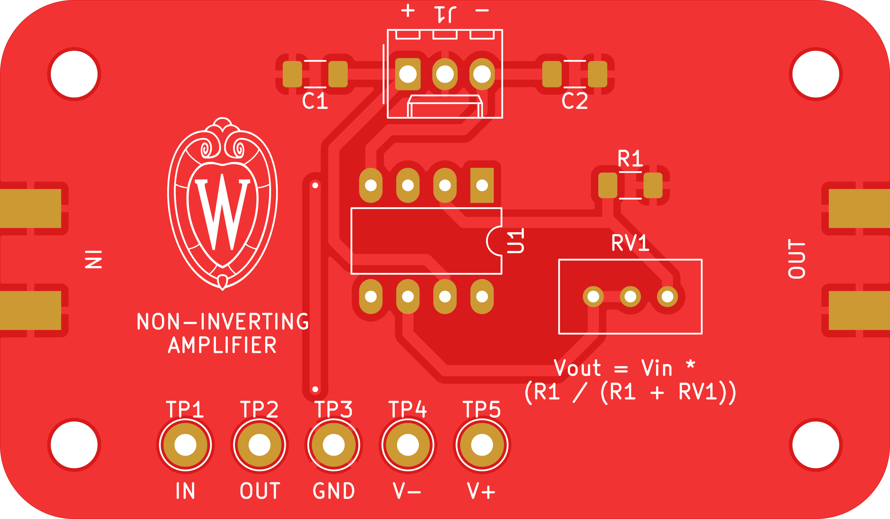

# non-inverting-amplifier

A very simple non-inverting amplifier.

## PCB

This PCB was designed using KiCAD version 5.
Refer to `DC_Amplifier.pdf` for schematic.
PCB images generated with [tracespace](https://github.com/tracespace/tracespace) follow.

Bill of Materials

| reference      | value         | manufacturer | part number          | vendors |
| :------------- | :------------ | :----------- | :------------------- | :------ | 

## Changelog

### 1.1.0

#### Changed
- prepared for professional printing
- changed to surface-mount passives

### 1.0.0

#### Added
- initial design
